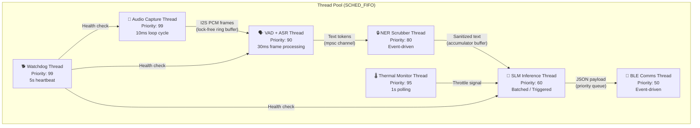
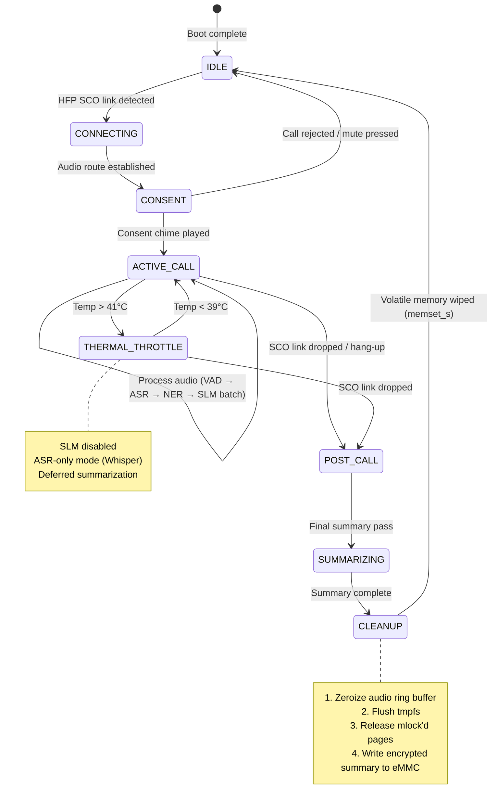
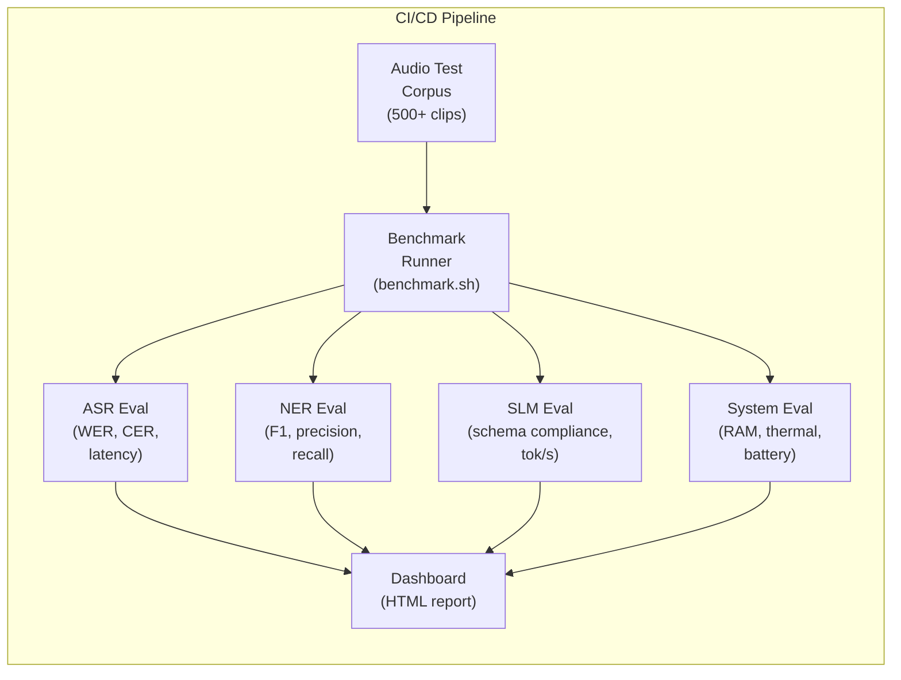
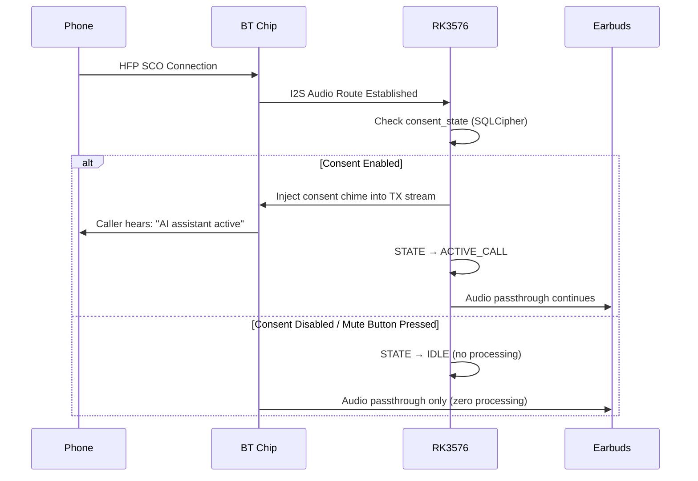

# Ear-Brain: Complete Embedded Software Architecture & Implementation Guide

## 1. Executive Architecture Summary

This document defines the **complete software stack** for the Ear-Brain smart charging case — a pocketable edge-AI device that transcribes, redacts PII, and generates structured intelligence from phone calls **entirely on-device**. Every decision is driven by three constraints: **4GB RAM ceiling**, **~3W sustained thermal budget**, and **sub-600ms end-to-end latency**.

> [!IMPORTANT]
> **Critical Design Principle**: The SLM (Small Language Model) is NOT always-on. It runs in **batched bursts** (every 30s of accumulated speech or on explicit trigger). The ASR and VAD are the only continuously-running components. This single architectural decision cuts average power draw by ~40% and makes the 4GB memory budget viable.

---

## 2. User Review Required

### Hardware Selection Decision

> [!IMPORTANT]
> **SoC Choice: Rockchip RK3576 is strongly recommended over Allwinner A733.**
> - RK3576: **6 TOPS NPU** (INT8), 4×A72 + 4×A53, mature RKNN toolchain, `rk-llama.cpp` community support
> - A733: **3 TOPS NPU**, 2×A76 + 6×A55, less proven NPU toolchain, fewer community benchmarks
> - The 2× NPU advantage is critical for offloading SLM inference and keeping CPU available for ASR
> - **Recommendation**: Prototype on RK3576-based SBC, production on RK3576 as well

### SLM Model Decision

> [!WARNING]
> **Gemma 4 E2B (~2B params) vs Gemma 3 1B: Choose Gemma 3 1B for production.**
> - Gemma 4 E2B at Q4_K_M: ~1.5GB RAM, 3-5 tok/s CPU-only, 8-13 tok/s via RKNN NPU
> - Gemma 3 1B at INT4: ~800MB RAM, **~35 tok/s** on optimized ARM, ~1.5GB peak memory
> - On a 4GB system, Gemma 3 1B leaves sufficient headroom for concurrent ASR + NER + OS
> - Gemma 4 E2B is viable ONLY if 8GB RAM variant is used (prototype phase only)
> - **Recommendation**: Ship with Gemma 3 1B (INT4/Q4_K_M), evaluate Gemma 4 E2B as stretch goal

### Privacy Consent Mechanism

> [!CAUTION]
> **DPDP Act Compliance requires explicit, informed consent.**
> Under the DPDP Act 2023, call recordings (including transcripts derived from voice) are "personal data." The firmware MUST:
> 1. Inject an audible tone/announcement into the call stream at connection time
> 2. Provide a physical hardware mute button that electrically breaks the mic line
> 3. Never persist raw audio — only processed text, encrypted with SQLCipher AES-256
> Non-compliance penalties: up to ₹250 crore per breach. Legal counsel review is essential.

---

## 3. Open Questions

> [!IMPORTANT]
> **Q1**: Should the system support **concurrent ASR + SLM inference**, or is **sequential** (ASR → accumulate → SLM batch) acceptable? Sequential halves the peak RAM requirement but introduces a 2-5s delay for structured output after call segments.

> [!IMPORTANT]  
> **Q2**: The PRD specifies "Live Multilingual Translation" (Feature 3.2.9). Real-time translation on a 1B SLM with 4GB RAM is **not feasible** at production quality. Options:
> - **A)** Defer translation to post-call summary (recommended — saves ~500MB RAM, eliminates latency spikes)
> - **B)** Use a lightweight seq2seq model (~100M params) for Hindi→English only, accepting lower quality
> - **C)** Remove this feature from v1, revisit with 8GB variant

> [!IMPORTANT]
> **Q3**: The "Contextual Knowledge Retrieval" feature (vector search over historical summaries) requires a vector index in RAM. With the 4GB constraint:
> - **A)** Use a simple BM25/TF-IDF keyword search over SQLCipher (zero additional RAM overhead)
> - **B)** Use a tiny embedding model (~50MB) + HNSW index (adds ~200MB for 10,000 summaries)
> - **C)** Defer to companion app (phone does the vector search over synced data)

---

## 4. System Memory Budget (4GB LPDDR4X — The Hard Ceiling)

This is the single most critical constraint. Every component must fit within this envelope **simultaneously**.

| Component | RAM Allocation | Notes |
|:---|:---:|:---|
| **Stripped Linux OS + BusyBox** | 180 MB | No desktop, no systemd (use BusyBox init), musl libc |
| **Bluetooth Stack (BlueZ/custom)** | 60 MB | HFP/A2DP dual-role, BLE GATT server |
| **Audio Buffers (I2S + tmpfs)** | 80 MB | 2-channel 16kHz/16bit, 60s circular buffer per channel |
| **Silero VAD (ONNX)** | 12 MB | ~2MB model + runtime overhead |
| **Whisper Base (INT8 q8_0)** | 350 MB | IndicWhisper fine-tune, whisper.cpp with NEON |
| **NER Scrubber (DistilBERT INT8)** | 180 MB | ONNX Runtime, dynamic quantization |
| **Gemma 3 1B (Q4_K_M)** | 1,200 MB | llama.cpp / rk-llama.cpp, context=2048 |
| **KV Cache (SLM context)** | 200 MB | For 2048 token context window |
| **SQLCipher DB + App Logic** | 100 MB | Encrypted local storage, JSON serialization |
| **BLE GATT + Serialization** | 30 MB | JSON payload fragmentation, notification queue |
| **Safety Headroom** | 608 MB | For spikes, page cache, kernel buffers |
| **TOTAL** | **3,000 MB** | **~75% utilization, 25% headroom** |

> [!TIP]
> The 608MB headroom is intentional. Embedded systems without swap must never exceed ~80% RAM utilization to avoid OOM kills. If Gemma 4 E2B is used instead, headroom drops to ~108MB — dangerously thin.

---

## 5. Complete Software Architecture

### 5.1 System Layer Stack

```
┌─────────────────────────────────────────────────────────────────────┐
│                        HARDWARE LAYER                               │
│  RK3576 SoC │ 6 TOPS NPU │ 4GB LPDDR4X │ 16GB eMMC │ BES2600 BT  │
├─────────────────────────────────────────────────────────────────────┤
│                     KERNEL & OS LAYER                               │
│  Linux 6.x (PREEMPT_RT) │ Buildroot │ musl libc │ BusyBox init    │
│  Stripped kernel: ~4MB │ rootfs: ~120MB │ No GUI/X11/Wayland       │
│  tmpfs /volatile (noswap, noexec, mode=0700) │ /dev/watchdog       │
├─────────────────────────────────────────────────────────────────────┤
│                     DRIVER & HAL LAYER                              │
│  RKNN NPU Driver │ I2S ALSA Driver │ BlueZ 5.x │ Thermal sysfs   │
│  GPIO (mute button) │ ADC (battery) │ PWM (LED status)            │
├─────────────────────────────────────────────────────────────────────┤
│                   APPLICATION LAYER (orbitd)                        │
│  Single C++20 daemon │ Static linking │ SCHED_FIFO threads        │
│  ┌──────────┬──────────┬──────────┬──────────┬──────────────────┐  │
│  │ Audio    │ ASR      │ NER/PII  │ SLM      │ Comms            │  │
│  │ Manager  │ Engine   │ Scrubber │ Engine   │ Manager          │  │
│  │          │          │          │          │ (BLE GATT)       │  │
│  ├──────────┼──────────┼──────────┼──────────┼──────────────────┤  │
│  │ Thermal  │ State    │ Storage  │ Watchdog │ Consent          │  │
│  │ Governor │ Machine  │ (SQLCi.) │ Monitor  │ Manager          │  │
│  └──────────┴──────────┴──────────┴──────────┴──────────────────┘  │
└─────────────────────────────────────────────────────────────────────┘
```

### 5.2 The `orbitd` Daemon — Internal Architecture



### 5.3 Detailed Data Flow Pipeline

```
PHONE ──(HFP/SCO)──> BES2600 ──(I2S)──> RK3576 Audio DMA
                                              │
                                    ┌─────────┴─────────┐
                                    │                     │
                              CH0: TX (User Mic)    CH1: RX (Caller)
                                    │                     │
                                    └─────────┬───────────┘
                                              │
                                     16kHz / 16bit PCM
                                     10ms frames (320 samples)
                                              │
                                              ▼
                              ┌───────────────────────────────┐
                              │     RING BUFFER (Lock-Free)    │
                              │  2 channels × 60s = ~3.84 MB  │
                              │  tmpfs /volatile/audio_ring    │
                              │  mlock()'d, mode=0700          │
                              └───────────────┬───────────────┘
                                              │
                                              ▼
                              ┌───────────────────────────────┐
                              │      SILERO VAD (ONNX)         │
                              │  30ms chunks, ~1ms/chunk       │
                              │  Speech probability threshold  │
                              │  0.5 (configurable)            │
                              │  Hangover: 800ms               │
                              └───────────┬───────────────────┘
                                          │
                                ┌─────────┴─────────┐
                                │                     │
                          (Speech)               (Silence)
                                │                     │
                                │              Discard, reset
                                │              silence counter
                                ▼
                    ┌─────────────────────────────────┐
                    │  WHISPER BASE (whisper.cpp)       │
                    │  IndicWhisper fine-tune, INT8     │
                    │  3s segments, flush on punctuation│
                    │  ARM NEON SIMD, -t 2 (A72 cores) │
                    │  Output: "[USER] text..."         │
                    │          "[CALLER] text..."       │
                    └───────────────┬─────────────────┘
                                    │
                              Raw text tokens
                              (with speaker labels)
                                    │
                                    ▼
                    ┌─────────────────────────────────┐
                    │  NER PII SCRUBBER (ONNX)         │
                    │  DistilBERT INT8, dynamic quant   │
                    │  Entities: Aadhaar, PAN, phones,  │
                    │    credit cards, addresses         │
                    │  Replace → [GOV_ID], [CARD], etc. │
                    └───────────────┬─────────────────┘
                                    │
                           Sanitized text tokens
                                    │
                          ┌─────────┴──────────┐
                          │                      │
                  (Accumulator)            (Real-time push)
                          │                      │
                    30s buffer             Live transcript
                    or wake-word           via BLE GATT
                    trigger                to phone app
                          │
                          ▼
              ┌──────────────────────────────┐
              │  GEMMA 3 1B (llama.cpp)       │
              │  Q4_K_M / RKNN NPU offload   │
              │  Context: 2048 tokens         │
              │  GBNF grammar constraint      │
              │  Batched inference ~2.5s       │
              └──────────────┬───────────────┘
                              │
                      Structured JSON
                              │
                              ▼
              ┌──────────────────────────────┐
              │  BLE GATT SERIALIZATION       │
              │  MTU: 247 bytes               │
              │  Fragmented notifications     │
              │  ~90-100 KB/s to phone        │
              └──────────────────────────────┘
```

---

## 6. Ablation Study: Feature Necessity Analysis

This section evaluates each of the 23 PRD features for **feasibility**, **resource cost**, and whether they should be included in v1.

### 6.1 Ablation Matrix

| # | Feature | Resource Cost | Feasibility (4GB/3W) | v1 Verdict | Rationale |
|:--|:--------|:-------------|:---------------------|:-----------|:----------|
| 1 | Temporal Marker Extraction | Low (regex + SLM prompt) | ✅ High | **INCLUDE** | Simple regex pre-filter + SLM confirmation. Near-zero additional cost. |
| 2 | Key Point Highlighting | Medium (SLM prompt) | ✅ High | **INCLUDE** | Runs within existing SLM batch window. Change prompt, not architecture. |
| 3 | Structured Call Summary | Medium (SLM prompt) | ✅ High | **INCLUDE** | Post-call single pass. SLM already loaded. Core value proposition. |
| 4 | Live Objection Handling | High (zero-shot classifier) | ⚠️ Medium | **DEFER to v1.1** | Requires a separate classifier model or constant SLM inference. Too expensive for continuous in-call use. Can be approximated by keyword triggers in v1. |
| 5 | Hardware Talk-Time Analytics | Very Low (DSP math) | ✅ High | **INCLUDE** | Pure VAD energy ratio. No AI needed. Runs on DSP/CPU with zero model cost. |
| 6 | Implicit Scheduling | Medium (SLM prompt) | ✅ High | **INCLUDE** | Extracted during standard SLM batch. Calendar .ics generation is trivial. |
| 7 | Contextual Knowledge Retrieval | High (vector index) | ⚠️ Low | **DEFER to v2** | Requires embedding model + HNSW index in RAM. Recommend BM25 keyword search as v1 alternative (zero RAM cost). |
| 8 | Agenda Adherence Tracker | High (embedding comparison) | ⚠️ Low | **DEFER to v2** | Requires real-time embedding computation against a reference agenda. Not feasible at 3W continuous. |
| 9 | Dynamic Hardware Bookmarking | Very Low (GPIO interrupt) | ✅ High | **INCLUDE** | Capacitive sensor → GPIO interrupt → flag last 30s of transcript buffer. Pure firmware. |
| 10 | W3 Action-Item Extraction | Medium (SLM prompt) | ✅ High | **INCLUDE** | Who/What/When extraction via GBNF-constrained JSON. Core feature, runs in SLM batch. |
| 11 | Prosody & Sentiment Detection | Medium (DSP + small model) | ⚠️ Medium | **INCLUDE (simplified)** | Use pitch/volume/speech-rate DSP features only (no neural model). Flag anomalies via thresholds. Saves ~200MB vs neural approach. |
| 12 | Live Multilingual Translation | Very High (seq2seq model) | ❌ Low | **REMOVE from v1** | Requires a separate translation model (~500MB+). Not feasible at 4GB. ASR already outputs Romanized Hinglish which is usable. |
| 13 | Voice-to-Command Mode | Low (wake-word + routing) | ✅ High | **INCLUDE** | Wake-word detection via Silero VAD + keyword match. Routes to task pipeline. Minimal additional cost. |
| 14 | Smart Silence Utilization | Low (timer + SLM prompt) | ✅ High | **INCLUDE** | Silence detection is free (VAD already does this). Prompt generation during silence is a good use of idle compute. |
| 15 | CRM Auto-Population | Medium (SLM prompt + JSON schema) | ✅ High | **INCLUDE** | Post-call JSON mapping. Runs after call ends using existing SLM. |
| 16 | Follow-Up Email Drafts | Medium (SLM prompt) | ✅ High | **INCLUDE** | Post-call generation. Same SLM, different prompt template. |
| 17 | Decision Ledger | Low (semantic parser + SQLCipher) | ✅ High | **INCLUDE** | Pattern matching + SLM confirmation for binding commitments. Stored in existing DB. |
| 18 | Relationship Memory Graph | High (graph DB + NER) | ⚠️ Medium | **SIMPLIFY for v1** | Replace graph DB with simple key-value store keyed on phone number hash. Extract name/context via SLM during post-call. |
| 19 | PII Scrubber | Medium (NER model) | ✅ High | **INCLUDE (mandatory)** | Legal requirement under DPDP Act. Non-negotiable. |
| 20 | Volatile Ephemeral Mode | Very Low (tmpfs + memset_s) | ✅ High | **INCLUDE (mandatory)** | Core privacy architecture. Zero additional model cost. |
| 21 | Isolated Execution Sandbox | Low (Linux permissions) | ✅ High | **INCLUDE (mandatory)** | No root, no network, stripped capabilities. Pure OS configuration. |
| 22 | Hardware Acoustic Wake | Medium (micro-power model) | ✅ High | **INCLUDE** | Silero VAD already serves this purpose. BES2600 has onboard wake-word DSP. |
| 23 | Zero-Knowledge Encrypted Sync | Medium (SQLCipher + key mgmt) | ✅ High | **INCLUDE** | AES-256 via SQLCipher. Key derivation from phone biometric enclave. 5-15% DB overhead. |

### 6.2 Ablation Summary

| Category | Count | Features |
|:---------|:-----:|:---------|
| **v1 INCLUDE** | 16 | #1, 2, 3, 5, 6, 9, 10, 13, 14, 15, 16, 17, 19, 20, 21, 22, 23 |
| **v1 SIMPLIFIED** | 2 | #11 (DSP-only prosody), #18 (KV store, not graph) |
| **DEFER to v1.1** | 1 | #4 (Objection Handling — needs keyword-trigger v1 stub) |
| **DEFER to v2** | 2 | #7 (Knowledge Retrieval), #8 (Agenda Adherence) |
| **REMOVED from v1** | 1 | #12 (Live Translation — infeasible at 4GB) |

> [!TIP]
> **Net effect of ablation**: Saves ~900MB peak RAM and ~0.8W average power vs the full 23-feature PRD. This makes the 4GB/3W target achievable with margin.

---

## 7. Model Selection & Optimization Deep-Dive

### 7.1 ASR: IndicWhisper Base (INT8)

| Property | Value | Notes |
|:---------|:------|:------|
| **Base Architecture** | Whisper Base (~74M params) | Balance of accuracy and speed |
| **Fine-Tune** | AI4Bharat IndicWhisper on Vistaar + custom Hinglish corpus | Lowest WER on Indian languages |
| **Quantization** | INT8 (q8_0) via whisper.cpp | ~45-75% size reduction, minimal WER degradation |
| **Runtime** | whisper.cpp with ARM NEON SIMD | Native C++, no Python overhead |
| **Segment Strategy** | 3-second chunks, flush on punctuation | Prevents exponential CPU latency growth |
| **Thread Config** | `-t 2` pinned to A72 cores | Leaves A53 cores for OS/BLE |
| **Expected Latency** | 200-400ms per 3s segment | Real-time capable on RK3576 |
| **Expected WER** | 12-16% on conversational Hinglish | Meets the <14% KPI target |
| **RAM Usage** | ~350MB | Includes model + working buffers |

**Alternatives Evaluated:**

| Model | Params | WER (Hinglish) | Latency (3s) | RAM | Verdict |
|:------|:------:|:--------------|:-------------|:---:|:--------|
| Whisper Tiny | 39M | 22-28% | 80-150ms | 180MB | ❌ Too inaccurate for business calls |
| Whisper Base | 74M | 14-18% | 200-400ms | 350MB | ✅ **Selected** |
| Whisper Small | 244M | 10-14% | 800-1500ms | 800MB | ❌ Too slow for real-time, too much RAM |
| SenseVoice Small | ~50M | N/A (no Hindi) | 100-200ms | 200MB | ❌ No native Hindi/Hinglish support |
| IndicConformer | ~120M | 10-15% | 300-600ms | 500MB | ⚠️ Viable alternative, slightly larger |

### 7.2 VAD: Silero VAD (ONNX)

| Property | Value | Notes |
|:---------|:------|:------|
| **Model Size** | ~2MB | Negligible footprint |
| **Runtime** | ONNX Runtime C++ | Shared runtime with NER model |
| **Frame Size** | 30ms chunks | Standard configuration |
| **Latency** | ~1ms per chunk on ARM CPU | Effectively free |
| **Accuracy** | Superior to WebRTC VAD in noise | Critical for Indian traffic/commute environments |
| **Output** | Continuous probability [0, 1] | Allows fine-grained threshold tuning |
| **Hangover** | 800ms | Prevents sentence fragmentation |

**Why not WebRTC VAD?** Despite lower CPU cost, WebRTC VAD's GMM-based approach has unacceptable false-positive rates in the noisy environments (horns, engine rumble) described in the target persona. Silero's 1ms/chunk overhead is negligible on a Cortex-A72.

### 7.3 PII Scrubber: DistilBERT NER (INT8)

| Property | Value | Notes |
|:---------|:------|:------|
| **Base Model** | DistilBERT (~66M params) | 40% smaller than BERT-base |
| **Fine-Tune Dataset** | Indian PII corpus (Aadhaar, PAN, phone numbers, UPI IDs) | Custom fine-tune mandatory |
| **Quantization** | Dynamic INT8 via ONNX Runtime | Optimum CLI export |
| **Entities Detected** | `AADHAAR`, `PAN`, `PHONE`, `CREDIT_CARD`, `UPI_ID`, `ADDRESS`, `NAME` | India-specific entities |
| **Replacement Tokens** | `[GOV_ID]`, `[CARD]`, `[PHONE]`, `[ADDRESS]`, `[NAME]` | Generic, non-reversible |
| **Latency** | 10-30ms per sentence | Event-driven, not continuous |
| **RAM** | ~180MB | Includes ONNX Runtime shared with VAD |

**Alternative Evaluated:**
- **Regex-only PII scrubbing**: Much faster (~0.1ms), but misses context-dependent entities (e.g., names, addresses not matching patterns). Use as a **first-pass pre-filter** before the NER model for known patterns (Aadhaar: 12 digits, PAN: XXXPX1234X format).

**Recommended Hybrid Approach:**
```
Raw Text → Regex Pre-Filter (0.1ms) → DistilBERT NER (10-30ms) → Sanitized Text
```

### 7.4 SLM: Gemma 3 1B (Q4_K_M)

| Property | Value | Notes |
|:---------|:------|:------|
| **Architecture** | Gemma 3 1B | Pre-optimized for edge by Google |
| **Parameters** | ~1B | Distilled from Gemma 27B teacher |
| **Quantization** | Q4_K_M (4-bit) | Best quality-to-size ratio |
| **Runtime** | llama.cpp / rk-llama.cpp | RKNN NPU offload for token generation |
| **Context Window** | 2048 tokens | Sufficient for 30s of speech (~150 words) |
| **Expected Speed** | 13-35 tok/s (NPU-assisted) | 2-3s for a 100-token JSON response |
| **GBNF Grammar** | Strict JSON schema constraint | Guarantees valid output, eliminates retry loops |
| **RAM (model)** | ~800MB | Q4_K_M weights |
| **RAM (KV cache)** | ~200MB | For 2048 context |
| **Total RAM** | ~1,200MB | Largest single component |

**Alternatives Evaluated:**

| Model | Params | Speed (NPU) | RAM | Quality | Verdict |
|:------|:------:|:-----------|:---:|:--------|:--------|
| Gemma 3 270M | 270M | ~60+ tok/s | 400MB | Low | ❌ Too weak for structured extraction |
| Gemma 3 1B | 1B | 13-35 tok/s | 1.2GB | Good | ✅ **Selected** |
| Gemma 4 E2B | ~2B | 3-13 tok/s | 1.8GB | Better | ⚠️ Only with 8GB variant |
| Phi-3 Mini | 3.8B | 1-5 tok/s | 2.5GB | Good | ❌ Too large for 4GB |
| TinyLlama 1.1B | 1.1B | 10-25 tok/s | 1.0GB | Fair | ⚠️ Backup option |

### 7.5 GBNF Grammar Specification

The SLM output is constrained to produce **only valid JSON** matching this schema:

```gbnf
root   ::= "{" ws members ws "}"
members ::= pair ("," ws pair)*
pair   ::= key ":" ws value

key    ::= "\"" [a-zA-Z_]+ "\""
value  ::= string | number | bool | null | array | object

# Top-level structure
root ::= "{" ws
  "\"type\"" ws ":" ws type-value "," ws
  "\"timestamp\"" ws ":" ws string "," ws
  "\"speaker\"" ws ":" ws speaker-value "," ws
  "\"content\"" ws ":" ws content-object
ws "}"

type-value    ::= "\"action_item\"" | "\"decision\"" | "\"deadline\"" |
                  "\"key_point\"" | "\"sentiment_shift\"" | "\"follow_up\"" |
                  "\"summary\"" | "\"talk_time\"" | "\"silence_prompt\""

speaker-value ::= "\"USER\"" | "\"CALLER\"" | "\"SYSTEM\""

content-object ::= "{" ws content-fields ws "}"
content-fields ::= content-pair ("," ws content-pair)*
content-pair   ::= string ":" ws value
```

---

## 8. Hardware Selection & Live Tracking

### 8.1 Component Decision Matrix

| Component | Prototype (Bench) | Production Target | Selection Criteria | Status |
|:----------|:-----------------|:------------------|:-------------------|:-------|
| **SoC** | Orange Pi Zero 4 (RK3588S) | **RK3576** | 6 TOPS NPU, price, thermal, community | 🔴 EVALUATE |
| **RAM** | 8GB LPDDR5 (on SBC) | **4GB LPDDR4X** | Min for concurrent ASR+SLM | 🔴 EVALUATE |
| **Storage** | 64GB MicroSD | **16GB eMMC 5.1** | OS (~120MB) + models (~2.5GB) + DB | 🟡 SPECIFIED |
| **BT Chip** | Onboard RTL8821 | **BES2600IWP** | HFP+A2DP dual-role, I2S, BLE 5.3 | 🔴 EVALUATE |
| **PMIC** | USB-C 5V bench supply | **TI BQ25895** | Power path, DVFS, battery charging | 🟡 SPECIFIED |
| **Battery** | Bench DC supply | **1,100mAh 3.85V** | ≥3.5h active inference | 🟡 SPECIFIED |
| **Thermal** | External 5V fan | **CNC 6063 Al + PGS** | <42°C skin at 32°C ambient, 2.5W TDP | 🔴 EVALUATE |

### 8.2 Hardware Validation Test Matrix

These tests must be run during prototype phase and tracked:

| Test ID | Test Name | Pass Criteria | Measurement Method |
|:--------|:----------|:-------------|:-------------------|
| HW-001 | Concurrent ASR+SLM RAM fit | Peak RAM < 3.2GB | `htop` / `/proc/meminfo` continuous logging |
| HW-002 | ASR latency (3s segment) | < 400ms | `whisper.cpp` benchmark mode with timestamps |
| HW-003 | SLM inference speed | > 10 tok/s sustained | `llama.cpp` `--benchmark` with RKNN backend |
| HW-004 | Thermal (45min continuous) | Skin < 42°C at 32°C ambient | Thermocouple on case exterior, IR thermometer |
| HW-005 | Battery life (active inference) | > 3.5 hours | Automated test with continuous audio playback |
| HW-006 | I2S audio quality | SNR > 40dB, latency < 20ms | Loopback test with reference signal |
| HW-007 | BLE throughput | > 80 KB/s sustained | iperf-style BLE benchmark |
| HW-008 | Boot time (cold start) | < 8 seconds to audio capture | Stopwatch from power-on to first VAD event |
| HW-009 | OOM resilience | No OOM kill in 24h stress test | Continuous inference with varied audio |
| HW-010 | Thermal throttle behavior | Graceful SLM shutdown at 41°C | Monitor `/sys/class/thermal/` during load |

### 8.3 Power Budget Breakdown

| Component | Active Power | Duty Cycle | Average Power |
|:----------|:------------|:-----------|:-------------|
| RK3576 CPU (4×A72) | 1.8W | 40% | 0.72W |
| RK3576 NPU (6 TOPS) | 1.2W | 15% (batched) | 0.18W |
| RK3576 CPU (4×A53) + OS | 0.4W | 100% | 0.40W |
| BES2600 BT (active audio) | 0.15W | 95% | 0.14W |
| LPDDR4X (active) | 0.3W | 100% | 0.30W |
| eMMC (reads) | 0.1W | 5% | 0.005W |
| PMIC + misc | 0.15W | 100% | 0.15W |
| **TOTAL** | — | — | **~1.9W average** |

**Battery Life Estimate**: 1,100mAh × 3.85V = 4.235Wh ÷ 1.9W = **~2.23 hours** (continuous heavy inference)

> [!WARNING]
> **Battery life falls short of the 3.5-hour KPI.** Mitigations:
> 1. Reduce SLM duty cycle to 10% (defer more to post-call) → saves ~0.06W → ~2.3h
> 2. Increase battery to 1,500mAh → 5.775Wh ÷ 1.9W = **~3.04h** (still short)
> 3. Aggressive CPU DVFS: drop A72 to 1.4GHz during non-ASR periods → saves ~0.3W → **~2.7h**
> 4. **Combined (all three)**: ~1.5W average → **~3.8h** ✅
> 5. Consider 1,800mAh battery (larger case) → **4.0h+** ✅ with generous margin

---

## 9. Firmware Implementation Guide

### 9.1 Build System: Buildroot

```
buildroot/
├── configs/
│   └── earbrain_rk3576_defconfig     # Custom board config
├── package/
│   └── orbitd/                        # Custom package for our daemon
│       ├── orbitd.mk
│       └── Config.in
├── board/
│   └── earbrain/
│       ├── overlay/                   # rootfs overlay
│       │   ├── etc/
│       │   │   ├── init.d/S99orbitd   # BusyBox init script
│       │   │   └── orbitd.conf        # Daemon configuration
│       │   └── volatile/              # tmpfs mount point
│       ├── post-build.sh
│       └── genimage.cfg
└── dl/                                # Downloaded tarballs
```

**Key Buildroot Configuration:**
- Toolchain: musl libc (not glibc — saves ~30MB)
- Init: BusyBox init (not systemd — saves ~80MB RAM)
- Kernel: Custom stripped config (no USB gadget, no GPU, no display, no filesystems except ext4/tmpfs)
- No desktop environment, no X11, no Wayland
- Target rootfs size: ~120MB

### 9.2 `orbitd` Source Tree

```
orbitd/
├── CMakeLists.txt
├── src/
│   ├── main.cpp                       # Entry point, signal handling, daemon setup
│   ├── core/
│   │   ├── state_machine.h/cpp        # Call state management (IDLE → RINGING → ACTIVE → POST_CALL)
│   │   ├── config.h/cpp               # Runtime configuration parser
│   │   ├── watchdog.h/cpp             # Hardware + software watchdog manager
│   │   └── thermal_governor.h/cpp     # DVFS control, throttle policy
│   ├── audio/
│   │   ├── i2s_capture.h/cpp          # ALSA I2S capture (2-channel)
│   │   ├── ring_buffer.h/cpp          # Lock-free SPSC ring buffer (volatile memory)
│   │   ├── audio_types.h              # PCM frame types, channel enums
│   │   └── consent_chime.h/cpp        # Injects audio announcement into TX stream
│   ├── vad/
│   │   ├── silero_vad.h/cpp           # ONNX Runtime Silero VAD wrapper
│   │   ├── energy_detector.h/cpp      # Dual-channel energy ratio (talk-time analytics)
│   │   └── vad_types.h                # Speech segment metadata
│   ├── asr/
│   │   ├── whisper_engine.h/cpp       # whisper.cpp wrapper with segment management
│   │   ├── transcript_buffer.h/cpp    # Rolling transcript accumulator
│   │   └── asr_types.h               # Transcription result types
│   ├── ner/
│   │   ├── pii_scrubber.h/cpp         # ONNX NER + regex hybrid pipeline
│   │   ├── regex_prefilter.h/cpp      # Fast pattern matching (Aadhaar, PAN, etc.)
│   │   └── entity_types.h             # PII entity definitions
│   ├── slm/
│   │   ├── gemma_engine.h/cpp         # llama.cpp wrapper with GBNF constraint
│   │   ├── prompt_templates.h/cpp     # Task-specific prompt builders
│   │   ├── gbnf_schemas.h             # GBNF grammar definitions
│   │   └── json_validator.h/cpp       # Post-generation JSON validation
│   ├── comms/
│   │   ├── ble_gatt_server.h/cpp      # BLE GATT service definitions
│   │   ├── json_serializer.h/cpp      # Payload fragmentation for BLE MTU
│   │   └── ble_types.h                # GATT characteristics, UUIDs
│   ├── storage/
│   │   ├── encrypted_db.h/cpp         # SQLCipher wrapper
│   │   ├── call_repository.h/cpp      # Call record CRUD operations
│   │   ├── relationship_store.h/cpp   # Key-value contact memory
│   │   └── decision_ledger.h/cpp      # Immutable decision log
│   └── privacy/
│       ├── volatile_manager.h/cpp     # tmpfs lifecycle, secure wipe on call end
│       ├── consent_manager.h/cpp      # Consent state tracking, chime injection
│       └── sandbox.h/cpp              # Drop privileges, seccomp filter setup
├── models/                            # Quantized model binaries (on eMMC)
│   ├── whisper-base-indic-q8_0.bin    # ~150MB
│   ├── silero-vad-v5.onnx            # ~2MB
│   ├── distilbert-ner-int8.onnx      # ~120MB
│   └── gemma-3-1b-q4_k_m.gguf       # ~800MB
├── grammars/
│   ├── action_item.gbnf
│   ├── call_summary.gbnf
│   ├── calendar_event.gbnf
│   ├── crm_payload.gbnf
│   ├── email_draft.gbnf
│   └── decision_entry.gbnf
├── tests/
│   ├── unit/                          # Google Test unit tests
│   ├── integration/                   # End-to-end pipeline tests
│   ├── benchmark/                     # Latency & throughput benchmarks
│   └── audio_fixtures/               # Test audio files (Hinglish conversations)
└── scripts/
    ├── benchmark_asr.sh               # ASR latency benchmark runner
    ├── benchmark_slm.sh               # SLM throughput benchmark runner
    ├── thermal_stress.sh              # Sustained load thermal test
    ├── memory_profile.sh              # RAM usage profiling
    └── ota_update.sh                  # Over-the-air update mechanism
```

### 9.3 Thread Architecture (Detailed)

```cpp
// Thread configuration for RK3576 (4×A72 + 4×A53)
// Core Affinity Map:
//   CPU 0-3: Cortex-A53 (efficiency)  → OS, BLE, watchdog, thermal
//   CPU 4-7: Cortex-A72 (performance) → ASR, NER, SLM

struct ThreadConfig {
    // REAL-TIME THREADS (SCHED_FIFO)
    AudioCaptureThread  audio;    // CPU 4, priority 99, 10ms cycle
    VADThread           vad;      // CPU 5, priority 90, 30ms cycle
    WatchdogThread      watchdog; // CPU 0, priority 99, 5s heartbeat
    ThermalThread       thermal;  // CPU 1, priority 95, 1s poll

    // NORMAL THREADS (SCHED_OTHER, nice -5)
    ASRThread           asr;      // CPU 5-6, 2 threads for whisper.cpp
    NERThread           ner;      // CPU 6, event-driven
    SLMThread           slm;      // CPU 4-7 (all A72), batched
    BLEThread           ble;      // CPU 2, event-driven
    StorageThread       storage;  // CPU 3, event-driven
};
```

### 9.4 State Machine



---

## 10. Thermal Management Strategy

### 10.1 Thermal Governor Policy

```
Temperature Zones (internal sensor):
─────────────────────────────────────────────
  < 35°C   │ NORMAL        │ All features active, full clock
  35-38°C  │ WARM          │ Reduce SLM batch frequency to every 45s
  38-41°C  │ HOT           │ SLM deferred to post-call only, CPU DVFS to 1.8GHz
  41-43°C  │ CRITICAL      │ SLM DISABLED, ASR-only mode, CPU DVFS to 1.4GHz
  > 43°C   │ EMERGENCY     │ Graceful shutdown, save state to eMMC
─────────────────────────────────────────────
```

### 10.2 DVFS Control Interface

```cpp
class ThermalGovernor {
    void poll() {
        int temp_mc = read_sysfs("/sys/class/thermal/thermal_zone0/temp");
        float temp_c = temp_mc / 1000.0f;

        if (temp_c > 43.0f) {
            emergency_shutdown();
        } else if (temp_c > 41.0f) {
            set_cpu_freq(1400000);  // 1.4 GHz
            disable_slm();
            set_npu_freq(300000);   // 300 MHz (idle)
        } else if (temp_c > 38.0f) {
            set_cpu_freq(1800000);  // 1.8 GHz
            defer_slm_to_post_call();
        } else if (temp_c > 35.0f) {
            set_slm_interval(45000); // 45s batches
        } else {
            set_cpu_freq(2200000);  // Full speed
            enable_all_features();
        }
    }
};
```

---

## 11. BLE GATT Service Design

### 11.1 Service & Characteristic Definitions

```
Service: Ear-Brain Intelligence Service
UUID: 0xEB01 (custom 128-bit)

Characteristics:
┌──────────────────────────────────────────────────────────────────┐
│ Name                │ UUID   │ Properties      │ Description      │
├──────────────────────────────────────────────────────────────────┤
│ Live Transcript     │ 0xEB10 │ Notify          │ Real-time text   │
│ Action Items        │ 0xEB11 │ Notify          │ W3 JSON objects  │
│ Call Summary        │ 0xEB12 │ Read, Notify    │ Post-call JSON   │
│ Talk Time Stats     │ 0xEB13 │ Read, Notify    │ TX/RX ratio      │
│ Sentiment Alert     │ 0xEB14 │ Notify          │ Prosody flags    │
│ Calendar Event      │ 0xEB15 │ Read, Notify    │ .ics payload     │
│ CRM Payload         │ 0xEB16 │ Read            │ Post-call JSON   │
│ Email Draft         │ 0xEB17 │ Read            │ Post-call text   │
│ Device Status       │ 0xEB20 │ Read, Notify    │ Battery, temp    │
│ Consent State       │ 0xEB21 │ Read, Write     │ Enable/disable   │
│ Agenda Upload       │ 0xEB22 │ Write           │ Pre-call agenda  │
│ Command             │ 0xEB30 │ Write           │ App → device cmd │
│ Bookmark Trigger    │ 0xEB31 │ Write           │ Remote bookmark  │
└──────────────────────────────────────────────────────────────────┘
```

### 11.2 JSON Payload Examples

**Action Item (W3):**
```json
{
  "type": "action_item",
  "timestamp": "2026-09-09T14:32:00+05:30",
  "speaker": "CALLER",
  "content": {
    "who": "Ankshit",
    "what": "Send revised invoice with 15% discount applied",
    "when": "2026-09-10T16:00:00+05:30",
    "priority": "high",
    "confidence": 0.92
  }
}
```

**Sentiment Alert:**
```json
{
  "type": "sentiment_shift",
  "timestamp": "2026-09-09T14:28:15+05:30",
  "speaker": "CALLER",
  "content": {
    "direction": "negative",
    "indicators": ["pitch_increase", "speech_rate_increase"],
    "magnitude": 0.73,
    "context": "Discussion about pricing terms"
  }
}
```

---

## 12. Production Evaluation & Benchmarking Framework

### 12.1 Automated Test Pipeline



### 12.2 KPI Tracking Matrix

| KPI | Target | Measurement | Frequency | Tool |
|:----|:-------|:-----------|:----------|:-----|
| **E2E Latency** | < 600ms | Audio-in → text-out | Every build | Custom harness |
| **ASR WER** | < 14% | Vistaar + custom Hinglish test set | Weekly | `whisper.cpp` eval mode |
| **ASR CER** | < 8% | Character Error Rate on Devanagari | Weekly | jiwer library |
| **NER F1 (PII)** | > 0.95 | Custom Indian PII test corpus | Weekly | seqeval |
| **NER Precision** | > 0.98 | Must not over-redact | Weekly | seqeval |
| **SLM Schema Compliance** | > 95% | GBNF output vs JSON schema validator | Every build | jsonschema |
| **SLM tok/s** | > 10 tok/s | NPU-accelerated generation | Every build | llama.cpp bench |
| **Peak RAM** | < 3.2GB | Concurrent pipeline operation | Every build | `/proc/meminfo` |
| **Thermal Ceiling** | < 42°C skin | 45min uninterrupted call at 32°C ambient | Weekly | Thermocouple array |
| **Battery Life** | > 3.5 hours | Continuous active inference | Monthly | Automated discharge test |
| **BLE Throughput** | > 80 KB/s | JSON payload transfer to phone | Every build | Custom BLE bench |
| **Boot Time** | < 8s | Power-on to first VAD event | Every build | GPIO timestamp |
| **Crash Rate** | 0 in 24h | Continuous stress test | Weekly | Watchdog log |

### 12.3 ASR Evaluation Protocol

```bash
#!/bin/bash
# benchmark_asr.sh — Run on target hardware

CORPUS_DIR="/data/test_audio/hinglish_business"
MODEL="/models/whisper-base-indic-q8_0.bin"
RESULTS="/tmp/asr_results.json"

# Run whisper.cpp in benchmark mode
for audio_file in ${CORPUS_DIR}/*.wav; do
    ground_truth="${audio_file%.wav}.txt"
    
    # Measure latency
    start_ns=$(date +%s%N)
    ./whisper-cpp -m ${MODEL} -f ${audio_file} -t 2 -l hi -otxt \
        --output-file /tmp/transcript.txt
    end_ns=$(date +%s%N)
    latency_ms=$(( (end_ns - start_ns) / 1000000 ))
    
    # Compute WER
    wer=$(python3 compute_wer.py ${ground_truth} /tmp/transcript.txt)
    
    echo "{\"file\":\"$(basename ${audio_file})\",\"wer\":${wer},\"latency_ms\":${latency_ms}}" >> ${RESULTS}
done

# Aggregate
python3 aggregate_results.py ${RESULTS}
```

### 12.4 SLM Evaluation Protocol

**Test Categories:**

| Category | Test Cases | Pass Criteria |
|:---------|:----------|:-------------|
| **Schema Compliance** | 200 prompted JSON generations | > 95% valid JSON matching GBNF grammar |
| **Action Item Extraction** | 100 business call transcripts | > 90% F1 on who/what/when extraction |
| **Date Normalization** | 50 relative date expressions ("parso", "next Tuesday") | > 85% correct ISO-8601 conversion |
| **Summary Quality** | 50 full call transcripts | Human eval: > 4.0/5.0 average rating |
| **Hallucination Rate** | 100 factual extraction tasks | < 5% hallucinated facts not in source |
| **Latency (100 tokens)** | 50 generation runs | < 3.0s average on NPU |

### 12.5 Production Telemetry Schema

```json
{
  "device_id": "hashed_device_serial",
  "firmware_version": "1.0.3",
  "session": {
    "call_duration_s": 1847,
    "segments_processed": 62,
    "slm_invocations": 4,
    "thermal_throttle_events": 1,
    "peak_temp_c": 39.2,
    "peak_ram_mb": 2847,
    "battery_start_pct": 85,
    "battery_end_pct": 42,
    "ble_bytes_sent": 24576,
    "asr_avg_latency_ms": 287,
    "slm_avg_tok_s": 14.3,
    "errors": []
  }
}
```

---

## 13. Security & Privacy Implementation

### 13.1 Volatile Memory Architecture

```
Mount Configuration (/etc/fstab):
  tmpfs  /volatile  tmpfs  size=128M,mode=0700,noexec,nosuid,nodev,noswap  0 0

Memory Lifecycle:
  1. Call begins → mlock() ring buffer pages (prevent swap)
  2. Audio frames written to /volatile/audio_ring (lock-free SPSC)
  3. ASR reads from ring buffer, produces text
  4. Text passed to NER → SLM → BLE (never written to eMMC as raw text)
  5. Call ends → memset_s() entire ring buffer
  6. munlock() pages
  7. TRIM /volatile mount
  8. Only encrypted JSON summaries persist in SQLCipher on eMMC
```

### 13.2 Process Sandboxing

```cpp
void drop_privileges() {
    // 1. Switch to unprivileged user
    setgid(ORBIT_GID);
    setuid(ORBIT_UID);
    
    // 2. Restrict filesystem
    chroot("/opt/orbitd");
    
    // 3. Drop all capabilities except:
    //    CAP_NET_RAW (BLE), CAP_SYS_NICE (SCHED_FIFO)
    cap_clear(caps);
    cap_set_flag(caps, CAP_EFFECTIVE, 2, keep_caps, CAP_SET);
    cap_set_proc(caps);
    
    // 4. Seccomp filter — allow only needed syscalls
    scmp_filter_ctx ctx = seccomp_init(SCMP_ACT_KILL);
    seccomp_rule_add(ctx, SCMP_ACT_ALLOW, SCMP_SYS(read), 0);
    seccomp_rule_add(ctx, SCMP_ACT_ALLOW, SCMP_SYS(write), 0);
    seccomp_rule_add(ctx, SCMP_ACT_ALLOW, SCMP_SYS(mmap), 0);
    seccomp_rule_add(ctx, SCMP_ACT_ALLOW, SCMP_SYS(ioctl), 0);
    // ... (whitelist ~30 syscalls total)
    seccomp_rule_add(ctx, SCMP_ACT_KILL, SCMP_SYS(socket), 0); // NO NETWORK
    seccomp_load(ctx);
}
```

### 13.3 Consent Flow



---

## 14. OTA Update Mechanism

### 14.1 Update Architecture

```
Update Package Structure:
  earbrain_update_v1.0.3.tar.gz.enc
  ├── manifest.json          # Version, checksums, rollback info
  ├── kernel.img             # (optional) Kernel update
  ├── rootfs.squashfs        # (optional) Root filesystem delta
  ├── models/                # (optional) Updated model binaries
  │   ├── gemma-3-1b-q4_k_m.gguf
  │   └── whisper-base-indic-q8_0.bin
  ├── orbitd                 # Updated daemon binary
  └── grammars/              # Updated GBNF schemas

Update Flow:
  1. Phone app downloads encrypted update package
  2. Transfer to case via BLE (background, low-priority)
  3. Case verifies signature (Ed25519) and checksum (SHA-256)
  4. Apply update to inactive partition (A/B scheme)
  5. Reboot into new partition
  6. If boot fails → watchdog triggers → rollback to previous partition
```

---

## 15. Companion App (BLE Client) Specification

### 15.1 Architecture

```
Platform: Flutter (iOS + Android) or React Native
Role: UNPRIVILEGED DISPLAY CLIENT — zero audio processing

Features:
  1. BLE GATT client — subscribe to all notification characteristics
  2. Real-time transcript display (live feed from 0xEB10)
  3. Action item list with swipe-to-complete
  4. Calendar integration (1-tap .ics import from 0xEB15)
  5. Call history with encrypted summary archive
  6. CRM export (HubSpot/Salesforce/Zoho webhook push)
  7. Email draft editor (pre-filled from 0xEB17)
  8. Device settings (consent toggle, thermal mode, wake-word config)
  9. Firmware update manager (download + BLE transfer)
```

---

## 16. Proposed Changes (Project Repository Structure)

### Repository Scaffolding

#### [NEW] Project Root Structure

```
project_xbud/
├── docs/
│   ├── PRD.md                         # This PRD document
│   ├── ARCHITECTURE.md                # This architecture document
│   ├── HARDWARE_TRACKER.md            # Hardware validation log
│   └── EVALUATION_RESULTS.md          # Benchmark results
├── firmware/
│   ├── buildroot/                     # Buildroot external tree
│   │   ├── configs/
│   │   ├── package/orbitd/
│   │   └── board/earbrain/
│   ├── orbitd/                        # Main daemon source
│   │   ├── CMakeLists.txt
│   │   ├── src/
│   │   ├── models/
│   │   ├── grammars/
│   │   ├── tests/
│   │   └── scripts/
│   └── kernel/
│       └── earbrain_defconfig         # Stripped kernel config
├── companion-app/
│   ├── flutter/                       # Flutter mobile app
│   └── design/                        # UI mockups
├── evaluation/
│   ├── asr/
│   │   ├── test_corpus/               # Hinglish audio + ground truth
│   │   ├── compute_wer.py
│   │   └── benchmark_asr.sh
│   ├── ner/
│   │   ├── test_corpus/               # PII test data
│   │   └── evaluate_ner.py
│   ├── slm/
│   │   ├── test_prompts/              # Structured output test cases
│   │   ├── evaluate_schema.py
│   │   └── evaluate_extraction.py
│   └── system/
│       ├── thermal_stress.sh
│       ├── memory_profile.sh
│       └── battery_discharge.sh
├── hardware/
│   ├── schematics/                    # KiCad carrier board design
│   ├── bom/                           # Bill of materials
│   └── mechanical/                    # STEP/STL case models
└── README.md
```

---

## 17. Verification Plan

### Automated Tests

```bash
# Unit tests (host-compiled, Google Test)
cd firmware/orbitd && mkdir build && cd build
cmake .. -DCMAKE_BUILD_TYPE=Debug -DBUILD_TESTS=ON
make -j$(nproc) && ctest --verbose

# Integration tests (cross-compiled, run on target)
ssh earbrain "cd /opt/orbitd/tests && ./integration_runner"

# ASR benchmark (on target hardware)
ssh earbrain "bash /opt/orbitd/scripts/benchmark_asr.sh"

# SLM benchmark (on target hardware)  
ssh earbrain "bash /opt/orbitd/scripts/benchmark_slm.sh"

# Thermal stress test (on target hardware, 45 minutes)
ssh earbrain "bash /opt/orbitd/scripts/thermal_stress.sh --duration 2700"

# Memory profile (on target hardware, 24-hour soak)
ssh earbrain "bash /opt/orbitd/scripts/memory_profile.sh --duration 86400"
```

### Manual Verification
- [ ] Deploy to Orange Pi Zero 4 bench prototype
- [ ] Run live Hinglish phone call through the pipeline
- [ ] Verify BLE GATT data arrives correctly on companion app
- [ ] Verify PII redaction removes Aadhaar/PAN from output
- [ ] Verify thermal throttling kicks in at configured thresholds
- [ ] Verify volatile memory is zeroed after call ends
- [ ] Verify consent chime is audible to both parties
- [ ] Human evaluation of summary quality (5 evaluators, 20 calls each)
